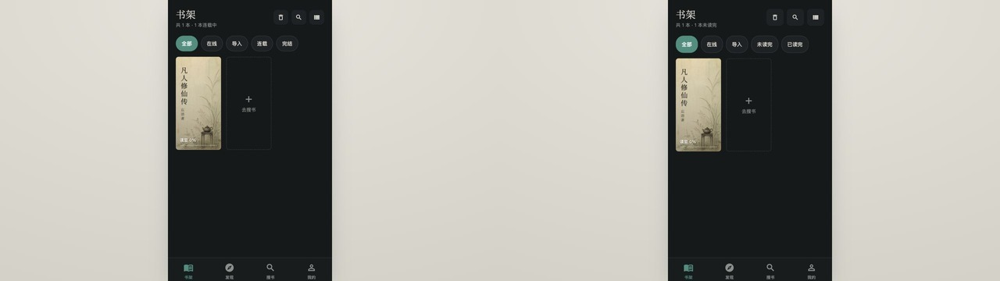
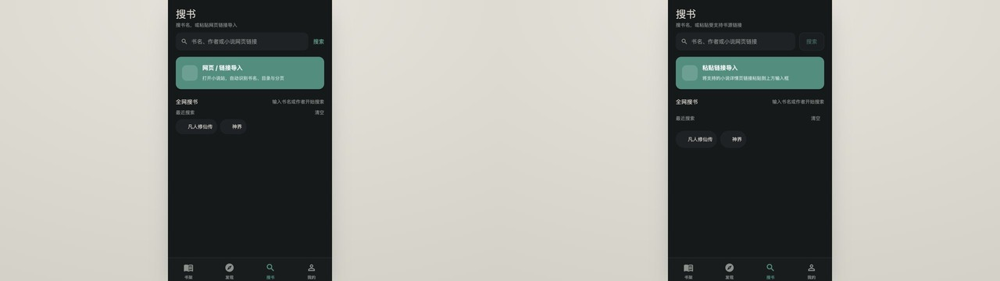
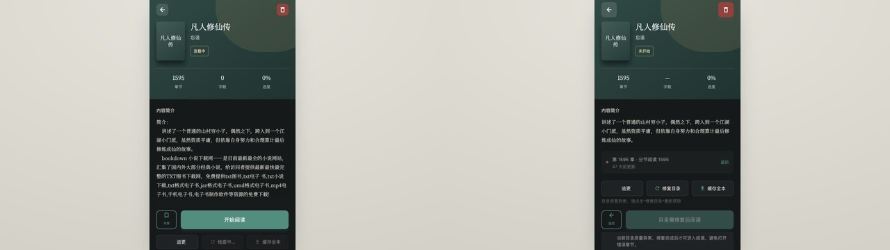
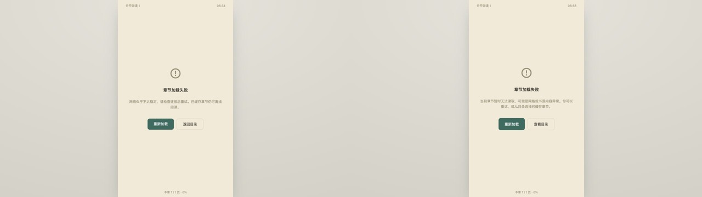
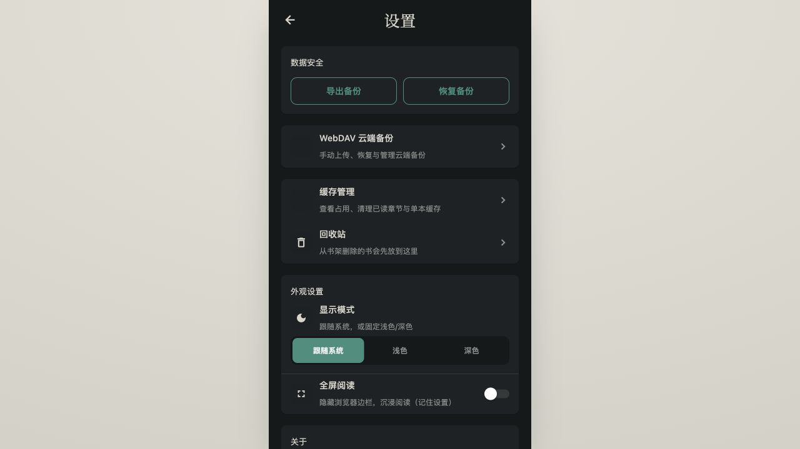
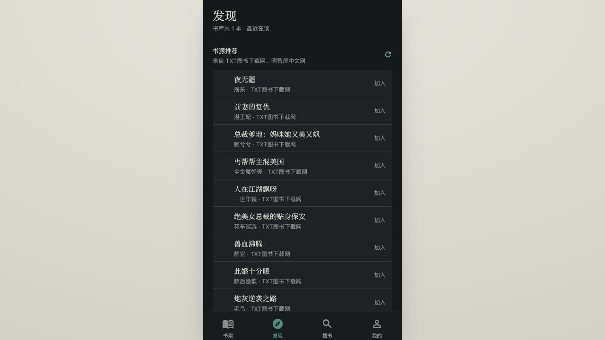

# SwellNovelApp 小说 UI/UX 审计与改造交付报告

> 审计与交付日期：2026-08-31
> 证据环境：Web，1280 × 720 视口
> 覆盖范围：书架、搜索、小说详情、阅读错误恢复、目录、设置与数据安全；Discover 纳入后续机会评估

## 1. 结论

本轮不建议整体重做。现有深绿界面、暖色纸张阅读背景、宋体标题与低饱和金色点缀已经形成稳定、安静且符合长时间阅读场景的视觉识别，应继续保留。

本轮升级重点是语义与关键流程：让“阅读状态”表达准确，让加载、失败、空结果和危险操作都有明确下一步，并阻止异常目录或过期异步请求把用户带入错误页面。改造后仍是同一套产品，而不是换皮或重建信息体系。

## 2. 审计范围与证据说明

- 原始 before/after 截图均在 Web 1280 × 720 视口下采集，页面使用居中的窄屏阅读器容器。
- compare 图为同状态左右对照，左侧是改造前，右侧是改造后。
- 截图验证可见层级、文案、布局、焦点轮廓和错误恢复入口；代码与 DOM 检查补充了按钮语义、状态属性和异步请求所有权。
- Web 证据不能替代 iOS/Android 真机、系统动态字体和原生辅助技术验证。

完整证据目录：[artifacts/ux-audit/2026-08-31](../../artifacts/ux-audit/2026-08-31/)。

| 步骤 | 页面或状态             | 当前健康度       | 证据                                                                                                                                                                                                                                                                                            |
| ---- | ---------------------- | ---------------- | ----------------------------------------------------------------------------------------------------------------------------------------------------------------------------------------------------------------------------------------------------------------------------------------------- |
| 1    | 书架默认态与筛选空态   | 良好             | [before](../../artifacts/ux-audit/2026-08-31/01-bookshelf.png) · [after](../../artifacts/ux-audit/2026-08-31/after-01-bookshelf.png) · [compare](../../artifacts/ux-audit/2026-08-31/compare-bookshelf.jpg)                                                                                     |
| 2    | 搜索默认态与搜索结果   | 良好             | [before](../../artifacts/ux-audit/2026-08-31/05-search.png) · [after](../../artifacts/ux-audit/2026-08-31/after-05-search.png) · [results](../../artifacts/ux-audit/2026-08-31/06-search-results.png) · [compare](../../artifacts/ux-audit/2026-08-31/compare-search.jpg)                       |
| 3    | 小说详情与异常目录门禁 | 有条件良好       | [before](../../artifacts/ux-audit/2026-08-31/02-book-detail.png) · [after](../../artifacts/ux-audit/2026-08-31/after-02-book-detail.png) · [compare](../../artifacts/ux-audit/2026-08-31/compare-book-detail.jpg)                                                                               |
| 4    | 阅读失败与目录回退     | 良好             | [before](../../artifacts/ux-audit/2026-08-31/03-reader-error.png) · [after](../../artifacts/ux-audit/2026-08-31/after-03-reader-error.png) · [directory](../../artifacts/ux-audit/2026-08-31/04-reader-directory.png) · [compare](../../artifacts/ux-audit/2026-08-31/compare-reader-error.jpg) |
| 5    | 设置、主题与数据安全   | 良好             | [设置改造后](../../artifacts/ux-audit/2026-08-31/after-09-settings-theme.png)                                                                                                                                                                                                                   |
| 6    | Discover 信息架构      | 可用，待 P2 优化 | [现状](../../artifacts/ux-audit/2026-08-31/07-discover.png)                                                                                                                                                                                                                                     |

## 3. 关键页面与流程状态

### 3.1 书架：从“分类展示”升级为可解释、可恢复的管理入口

已落地：

- 将原先容易被理解为作品连载状态的“连载 / 完结”，改为真实对应阅读进度的“未读完 / 已读完”。
- 书籍卡片、筛选项、搜索、视图切换和批量删除补充按钮角色、选中或禁用状态，并把核心点击区域提升到可触达尺寸。
- 筛选或搜索无结果时，文案会指出当前条件，并提供“清除筛选与搜索”，不再让用户自行排查隐藏条件。
- 增加书库恢复门禁：本地数据尚未恢复时显示加载状态，失败时提供重新读取，避免启动瞬间误显示“书架空空如也”。
- 空书架仍保留“去搜书”和“导入本地 TXT”两条清晰路径，没有为了视觉升级隐藏核心任务。

筛选空态证据：[改造前](../../artifacts/ux-audit/2026-08-31/08-bookshelf-filter-empty.png) · [改造后](../../artifacts/ux-audit/2026-08-31/after-08-bookshelf-filter-empty.png)。

### 3.2 搜索：区分关键词搜索与链接导入，并收紧异步状态

已落地：

- Web 端不再承诺不可用的内置浏览器，而是明确提示“粘贴链接导入”；原生端继续保留网页浏览与识别入口。
- 输入变化后立即清除旧关键词结果，搜索结果只属于最后一次明确提交的关键词。
- 关键词搜索、直链导入和搜索结果添加共用“最新请求”所有权。旧请求即使已经开始并最终把书加入书架，也不能再强制跳转详情、覆盖当前错误态或清除新请求的进行态。
- 搜索、导入、空结果和失败状态都有可见反馈；结果行会区分“加入书架”和“已在书架”。
- 同一帧连续点击会被同步请求锁拦截，避免重复入库或多个迟到导航竞争。

搜索结果证据：[已在书架状态](../../artifacts/ux-audit/2026-08-31/06-search-results.png)。

### 3.3 小说详情：修正内容可信度，并阻止坏目录进入阅读器

已落地：

- 将“连载中”改为“未开始 / 阅读中 / 已读完”，避免把用户阅读进度误当成作品出版状态。
- 在线正文尚未缓存时，字数显示为“—”并提供“字数未知”的辅助说明，不再把未知误报为 0。
- 清洗书源简介中的下载站、文件格式和脚本等噪声，保留真正的作品介绍。
- 最新章节卡片变成明确可操作入口；目录入口只打开目录，不再因“看一眼目录”改写续读位置。
- 检测到“分节阅读 N”等异常目录时，目录、最新章、缓存全本和开始阅读均进入门禁；页面明确说明需要先修复目录，避免用户进入必然失败的正文页。
- 书籍已被删除或链接失效时，不再停在无出口的“未找到书籍”，而是解释原因并提供返回书架。

当前状态为“有条件良好”：异常目录的阻断、文案和重试入口已经完成，但目录修复成功后的真实数据链路仍受外部书源网络限制，详见第 6 节。

### 3.4 阅读错误恢复：让失败页成为可继续的分岔点

已落地：

- 错误原因从笼统“网络似乎不稳定”调整为网络或书源内容异常，避免把所有失败错误归因给用户网络。
- 主操作为“重新加载”，次操作为“查看目录”；用户可重试当前章，也可转向已缓存章节。
- 错误标题、状态变化和操作按钮补充可读语义，按钮保持足够点击面积。
- 底部章节进度从“看起来可拖动但实际不可操作”的假滑块改为诚实的进度条语义；上一章、下一页或下一章均有明确标签和禁用状态。
- 阅读设置面板增加可滚动容器和安全区留白；亮度支持 adjustable 语义及增减操作，不再只依赖触摸拖动。
- 从详情页仅查看目录时先保持预览态，真正选章或关闭目录进入阅读后再记录时长与进度，避免目录浏览污染阅读统计。

目录证据：[阅读器目录](../../artifacts/ux-audit/2026-08-31/04-reader-directory.png)。该图同时记录了旧书源目录中“分节阅读 N”的质量问题；改造后的详情页会在修复完成前阻止进入此目录。

### 3.5 设置与数据安全：从二态开关修正为真实状态模型

已落地：

- 原二态“深色模式”开关无法表达自动模式，现改为“跟随系统 / 浅色 / 深色”三选一，并使用 radiogroup/radio 状态表达当前选择。
- 数据安全区集中提供本地导出、恢复、WebDAV 云端备份、缓存管理和回收站，信息层级与风险等级更清楚。
- 恢复备份前可预览书籍和章节；真正替换当前书库前再次说明不可撤销并要求确认。
- 清除 WebDAV 凭据会说明只删除本机连接信息、不删除云端文件；删除云端备份也增加不可撤销确认。
- 云端备份的预览、恢复、删除按钮补充可读名称、忙碌或禁用状态及统一点击区域。
- WebDAV 的加载失败、空列表、上传、下载和删除结果都有反馈，不再把失败与“云端暂无备份”混为一谈。

## 4. 保留的设计体系

本轮没有替换以下视觉基础：

- 深绿夜间界面作为书架、发现、搜索和设置的主背景。
- 暖白纸张背景作为阅读器与目录的主阅读表面。
- 宋体标题、低饱和金色装饰、圆角卡片与轻边框组成的安静阅读气质。
- 底部四栏导航和主要页面入口保持不变，降低老用户重新学习成本。

这套体系的问题不在视觉方向，而在状态表达和关键流程缺少约束。因此本轮以语义、恢复能力、危险操作和异步一致性为优先。

## 5. 无障碍进展与声明边界

本轮已补充多处按钮角色、标签、选中/禁用/忙碌状态、错误 live region、阅读进度 progressbar、亮度 adjustable 操作，以及一批核心 44px 级触控区域。Web 截图中也能看到键盘焦点轮廓。

但本报告**不宣称完整 WCAG 合规**。1280 × 720 Web 截图和代码语义无法证明以下内容：

- iOS VoiceOver 与 Android TalkBack 的实际朗读顺序、焦点回收和弹层关闭体验。
- 系统动态字体放大后的重排、截断和底部面板可滚动性；部分封面与紧凑按钮仍限制字体倍率。
- 浏览器高倍缩放、横屏、系统高对比度和不同平台字体度量下的完整表现。
- 所有颜色组合的自动化对比度结果，以及复杂目录和长书名下的极端内容测试。

因此当前结论应理解为“关键路径的可访问性基础已明显改善”，而不是“已通过完整 WCAG 验证”。

## 6. 外部依赖与端到端验证缺口

本轮 Web 视觉证据确认了异常目录门禁、修复中状态、正文加载失败提示、重试与目录回退，但外部书源网络在审计时不稳定。因此以下两条没有完成真实成功态的端到端闭环：

1. 异常目录经外部书源重新抓取后，成功替换为可信目录并解除详情页门禁。
2. 在线章节正文从外部书源成功拉取、进入阅读器、翻页并持久化续读位置。

这不是 UI 无状态，而是外部响应未能提供可重复的成功样本。报告不据此宣称目录修复和在线正文链路已完成生产级端到端验证；最终验收应在网络可达、书源响应稳定时补跑成功态与失败态。

## 7. 验证状态

本轮采用以下交付检查：

- Web 1280 × 720 before/after/compare 视觉证据复核。
- TypeScript 类型检查。
- 搜索请求竞态、阅读进度、目录质量、备份与核心书源相关测试。
- ESLint 与 Web production build。
- Git diff whitespace 检查。

最终本地回归结果：TypeScript 与版本一致性检查通过；Jest 共 **44 个测试套件、211 条测试全部通过**；ESLint **0 error、183 条非阻断 warning**；Web production build 通过。业务图片经 TinyPNG 压缩后，最大单图告警已消除；构建仍保留入口约 922 KiB 与代码拆分两条提示，已列入 P2 bundle 治理而不阻塞本轮功能交付。

## 8. 后续 P2

### P2-1：原生无障碍与动态字体设备走查

- 在 iOS VoiceOver 与 Android TalkBack 上按书架 → 搜索 → 详情 → 阅读 → 设置完整走查。
- 覆盖 200% 动态字体、长书名、长章节名、横屏和小屏设备。
- 重点检查弹层焦点、目录四标签朗读、进度与亮度调整，以及备份确认对话框。

### P2-2：Discover 信息架构

当前 Discover 首屏被纵向推荐列表占满，“最近在读”和“最近加入”又容易重复同一本书；同时独立“搜书”页已经承担发现入口。后续应明确 Discover 的单一职责：优先承载续读、追更更新和个性化推荐，缩短推荐列表或改为横向分组，并评估是否把搜索入口上移，而不是在本轮直接删除导航或整体重做。

### P2-3：Web bundle 体积

平台专用入口已经减少 Web 不需要的原生依赖，但首包预算、路由级拆分、图标与阅读器资源延迟加载仍需单独治理。后续应建立可持续的 bundle budget，并以最终 CI 产物记录基线和回归阈值；本文不固化中间构建数字。

## 9. 最终判断

SwellNovelApp 的视觉方向无需推翻。深绿/纸张体系具备识别度，主要问题已经从“需要换一套 UI”收敛为“让状态真实、失败可恢复、危险操作可预期、异步结果不串台”。本轮已完成这些高影响升级，并为尚未验证的外部书源成功链路与原生无障碍测试保留了清晰边界。
