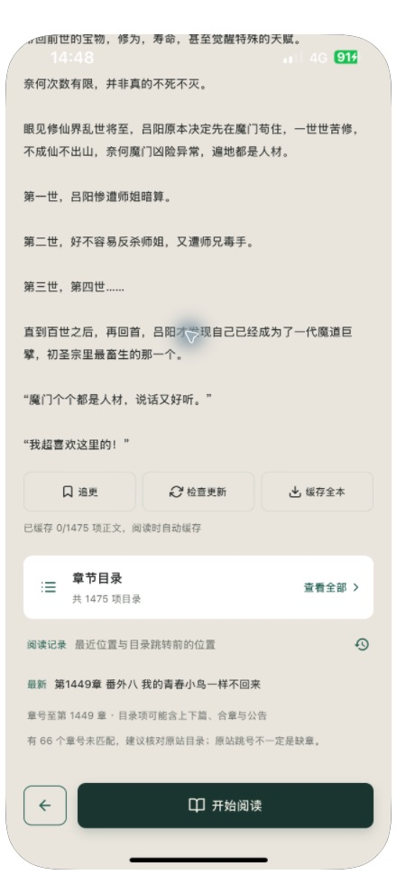
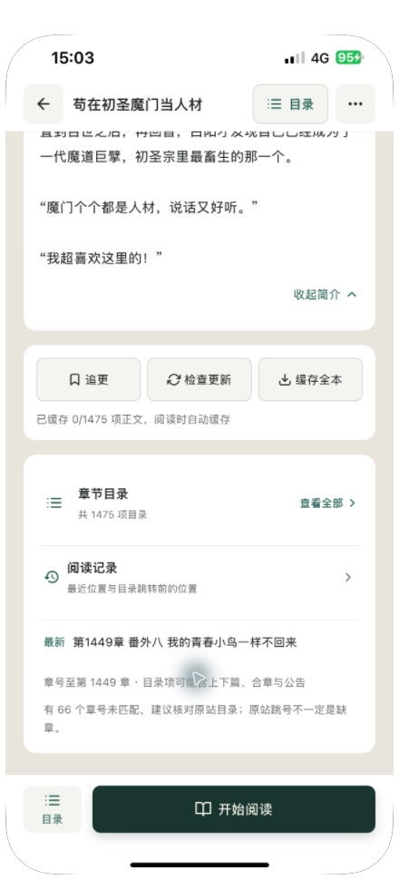
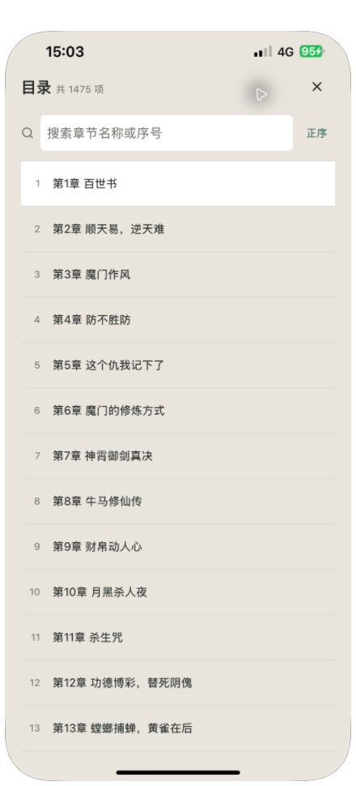

# 书籍详情页按钮、排版与吸顶走查

2026-10-09。产品界面走查按用户当前真机位置开始，沿用轻读已有深绿、米色与白色的设计语言。

## 当前问题与处理

1. 第二屏（真机原始状态）：简介正文滑到状态栏后方，原有顶部返回、目录和更多按钮跟随封面滚出屏幕，状态栏仍是浅色字；长简介、辅助按钮和下方信息大面积共用米色，内容层级弱。
2. 首屏：把导航从滚动区独立，保留首屏深绿背景；长简介默认显示四行并可展开、收起，封面信息和下方操作更容易找到。
3. 第二屏吸顶：按实测封面区高度切换导航背景和状态栏文字；浅色模式切为白色导航、深色书名，返回、目录与更多入口保持固定。
4. 辅助操作与阅读：简介、在线操作、目录记录使用独立内容卡片；追更状态使用浅绿填充，检查与缓存使用浅色按钮并增加文字尺寸。底部改为独立白色操作栏，目录入口与阅读主按钮明确分开；阅读记录与最新章节增加行间分隔，最新章节可显示两行。

原始真机第二屏：

## 真机镜像复核

15:02–15:04 在 Swell5 镜像中复核新版《苟在初圣魔门当人材》详情页。首屏保留深绿封面区，简介、在线操作和目录记录区使用白色卡片；用户协助滑动到第二屏后，顶部切换为白色书名栏，状态栏为深色文字，正文在导航栏下方滚动。固定导航和底部操作栏没有覆盖可点击内容。

顶部和底部目录入口都能打开同一个目录弹层，关闭后保留详情页滚动位置；顺序切换可用，复核后恢复正序。更多菜单位于固定栏下方，点空白区域可关闭。长简介可以展开、收起；在第二屏收起后，页面会重新排版并保持书名导航，无需返回首屏重新找按钮。

本轮未点击开始阅读、追更、缓存、更新或删除；这些数据流程依赖自动化回归，未将界面验收扩大为本轮网络更新验收。

## 验证与边界

- 77 套件、561 项测试通过，包含浅色/深色吸顶状态、固定目录入口不随内容滚走、简介展开收起及阅读位置不变、目录加载或修复时所有入口禁用；既有目录、缓存取消、更新失败恢复和阅读记录回归保持。
- TypeScript、ESLint 0 errors（全项目 191 warnings）、Web production 构建与 diff check 通过。Web 构建仍有两条包体积警告。
- Swell5 Release 构建、覆盖安装和启动成功；包内 main.jsbundle 生成时间晚于最终源码修改。书架与阅读记录保留。
- 真机镜像已恢复，上述首屏、第二屏与弹层截图均来自安装后的实际设备。远程滚动只能移动一小段，第二屏滚动由用户协助完成，其余点击、展开收起和入口复核通过镜像完成。
- iOS Simulator Release 另行构建成功；本轮视觉验收使用真机镜像，未以模拟器构建成功代替交互验证。
- 没有宣称 VoiceOver、全部字体倍率、横屏或完整无障碍合规已验收。导航/按钮角色和禁用状态保留，触摸目标至少 44pt。

本次详情页改动尚未提交；前一轮已暂存的广告净化改动保持。
